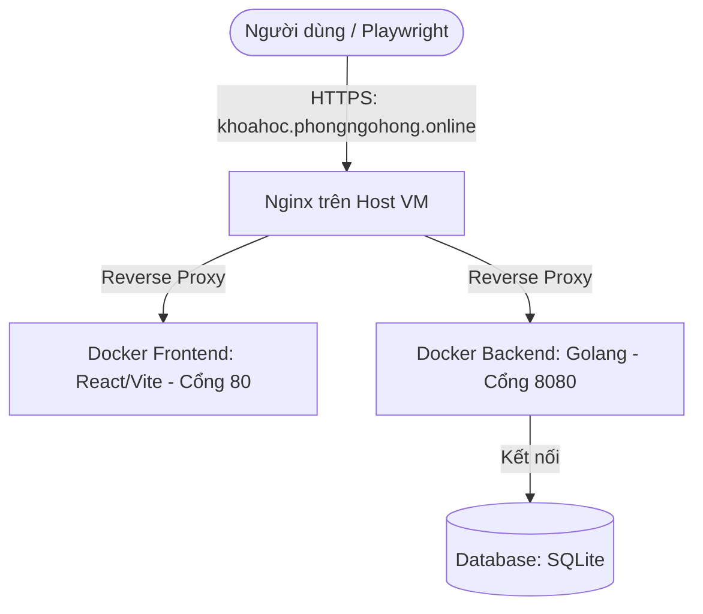

# Kế hoạch Triển khai Web khóa học & Kế hoạch Kiểm thử Playwright

Tài liệu này trình bày kế hoạch chi tiết để xây dựng, cấu hình máy chủ, deploy Docker/Nginx và thiết kế 64 testcases sử dụng Playwright cho trang web **khoahoc.phongngohong.online**.

---

## 1. Đề xuất cấu hình VM Instance trên Google Cloud Platform (GCP)

Để chạy một ứng dụng web thử nghiệm bao gồm Frontend, Backend, Database và Nginx thông qua Docker, cấu hình sau là tối ưu nhất về mặt chi phí và hiệu năng:

*   **Machine Type (Loại máy ảo):** `e2-small` (2 vCPUs, 2 GB RAM).
    *   *Lý do:* `e2-micro` (1 GB RAM) có thể bị quá tải khi build Docker hoặc chạy đồng thời nhiều container. `e2-small` là lựa chọn cân bằng và chi phí rất rẻ (khoảng ~$12/tháng).
*   **Hệ điều hành (OS):** `Ubuntu 24.04 LTS` hoặc `Debian 12`.
*   **Disk (Ổ đĩa):** `20 GB Balanced Persistent Disk` (hoặc SSD để tốc độ đọc ghi nhanh hơn).
*   **Firewall (Tường lửa):** Cho phép lưu lượng **HTTP** (cổng 80) và **HTTPS** (cổng 443).

---

## 2. Kiến trúc Hệ thống & Sơ đồ Deployment

Hệ thống sẽ được container hóa bằng Docker và điều phối qua Docker Compose để chạy trên VM GCP.



### Chi tiết các thành phần:
1.  **Nginx (Host VM):** Cài trực tiếp trên OS của VM để quản lý SSL Certbot (Let's Encrypt) cho tên miền `khoahoc.phongngohong.online`, sau đó reverse proxy vào Docker container.
2.  **Frontend Container:** Chạy React (Vite) + CSS/Tailwind. Được build và đóng gói bằng Nginx tĩnh trong Docker.
3.  **Backend Container:** Chạy ứng dụng Golang (sử dụng Gin hoặc Fiber) cung cấp các REST API phục vụ tìm kiếm, đánh giá và đăng ký.
4.  **Database:** Đề xuất dùng **SQLite** (được mount volume ra ngoài để lưu trữ). SQLite rất nhẹ, không tốn thêm tài nguyên RAM chạy container Database, và đặc biệt là cực kỳ dễ reset trạng thái dữ liệu (chỉ cần ghi đè file `.db` gốc) khi chạy test tự động.

---

## 3. Cấu trúc thư mục dự án (Monorepo)

Toàn bộ mã nguồn backend, frontend và testcases sẽ nằm chung một thư mục gốc để dễ quản lý và deploy:

```text
baigiuaky/
├── backend/                # Mã nguồn Golang
│   ├── main.go
│   ├── database/
│   ├── handlers/
│   ├── models/
│   ├── Dockerfile
│   └── data/               # Thư mục lưu database SQLite
│       └── courses.db
├── frontend/               # Mã nguồn React (Vite)
│   ├── src/
│   ├── package.json
│   ├── vite.config.js
│   └── Dockerfile
├── test/                   # Thư mục chứa kịch bản Playwright
│   ├── tests/
│   │   ├── search.spec.js
│   │   ├── review.spec.js
│   │   └── register.spec.js
│   ├── playwright.config.js
│   └── package.json
├── docker-compose.yml      # Cấu hình khởi chạy frontend + backend
└── README.md
```

---

## 4. Kế hoạch Thiết kế 64 Test Cases Playwright

Nhóm sẽ thực hiện tổng cộng **64 kịch bản test** cho 4 tính năng cốt lõi. Để phục vụ môn học kiểm thử, chúng ta sẽ cố tình thiết kế một số bug hợp lý ở Backend hoặc Frontend khiến một vài test case bị **FAILED** (cụ thể là 8 lỗi cố ý: TC-09, TC-23, TC-24, TC-59, TC-61, TC-62, TC-63, TC-64).

### Tính năng 1: Tìm kiếm khóa học & Bộ lọc (10 Test Cases)
*   **TC-01:** Tìm kiếm với từ khóa chính xác (VD: "Cơ Bản") -> Hiển thị đúng khóa học Golang Cơ Bản.
*   **TC-02:** Tìm kiếm không phân biệt chữ hoa/chữ thường (VD: "golang" và "GOLANG") -> Kết quả trả về giống nhau.
*   **TC-03:** Tìm kiếm với từ khóa không tồn tại -> Hiển thị thông báo "Không tìm thấy khóa học nào phù hợp".
*   **TC-04:** Tìm kiếm khi để trống ô nhập -> Hiển thị toàn bộ danh sách 6 khóa học ban đầu.
*   **TC-05:** Tìm kiếm chỉ chứa khoảng trắng -> Tự động loại bỏ khoảng trắng và hiển thị thông báo không tìm thấy kết quả.
*   **TC-06:** Kiểm thử độ an toàn bảo mật trước tấn công SQL Injection thông qua ô tìm kiếm -> Xử lý truy vấn an toàn và trả về không khớp kết quả.
*   **TC-07:** Lọc khóa học theo danh mục (Category) -> Hiển thị đúng khóa học của danh mục đó (ví dụ: "Golang").
*   **TC-08:** Lọc khóa học theo mức học phí (Miễn phí / Có phí) -> Kết quả hiển thị đúng giá.
*   **TC-09 (FAILED Ý ĐỒ):** Tìm kiếm với từ khóa cực dài (> 200 ký tự) -> *Ý đồ lỗi:* Frontend không giới hạn ký tự nhập gửi lên backend, backend trả về lỗi HTTP 500 (Internal Server Error) thay vì hiển thị thông báo lỗi thân thiện.
*   **TC-61 (FAILED Ý ĐỒ):** Lọc kết hợp danh mục + mức học phí (VD: "Go" + "Có phí") -> *Ý đồ lỗi:* Backend dùng else-if giữa điều kiện danh mục và giá nên khi đã chọn danh mục thì bỏ qua bộ lọc giá, trả về 2 khóa thay vì 1.

### Tính năng 2: Đánh giá khóa học (16 Test Cases)
*   **TC-10:** Gửi đánh giá thành công khi nhập đầy đủ thông tin (chọn số sao từ 1-5 và viết bình luận).
*   **TC-11:** Đánh giá khóa học khi chưa đăng nhập -> Các trường nhập bình luận và nút Gửi đánh giá bị disable và hiện cảnh báo.
*   **TC-12:** Đánh giá để trống phần bình luận nhưng chọn số sao -> Cho phép gửi đánh giá thành công (chỉ có sao).
*   **TC-13:** Đánh giá với số sao bằng 0 -> API chặn và trả về lỗi 400 Bad Request.
*   **TC-14:** Bình luận chỉ chứa khoảng trắng -> Trim khoảng trắng và báo lỗi bình luận quá ngắn (< 3 ký tự).
*   **TC-15:** Kiểm tra độ dài bình luận tối thiểu (VD: ít nhất 3 ký tự, nhập 2 ký tự báo lỗi).
*   **TC-16:** Kiểm tra độ dài bình luận tối đa (VD: tối đa 500 ký tự, vượt quá báo lỗi).
*   **TC-17:** Đánh giá của người dùng hiện lên ngay lập tức ở đầu danh sách đánh giá sau khi gửi thành công.
*   **TC-18:** SQL Injection trong bình luận -> Database xử lý an toàn và lưu trữ nội dung thô nguyên vẹn.
*   **TC-19:** Một tài khoản đánh giá nhiều lần trên cùng 1 khóa học -> Báo lỗi "Bạn đã đánh giá khóa học này rồi".
*   **TC-20:** Hiển thị điểm đánh giá trung bình cập nhật chính xác sau khi thêm đánh giá mới.
*   **TC-21:** Khôi phục trạng thái form (xóa trống comment và đưa rating về 5 sao) khi đóng và mở lại modal chi tiết.
*   **TC-22:** Gửi đánh giá chứa ký tự đặc biệt / Emoji -> Lưu trữ và hiển thị chính xác các emoji.
*   **TC-23 (FAILED Ý ĐỒ):** Click nút "Gửi" đánh giá liên tục (Spam) -> *Ý đồ lỗi:* Frontend không disable nút submit, backend nhận request đồng thời gây ra lỗi Race Condition, tạo ra 2 đánh giá trùng lặp.
*   **TC-24 (FAILED Ý ĐỒ):** Gửi bình luận chứa mã script độc hại (XSS / HTML Injection) -> *Ý đồ lỗi:* Frontend hiển thị bình luận qua `dangerouslySetInnerHTML` mà không vệ sinh dữ liệu, script được thực thi làm thay đổi biến toàn cục.
*   **TC-62 (FAILED Ý ĐỒ):** Điểm trung bình không được làm tròn ở trang chi tiết -> *Ý đồ lỗi:* Trang chi tiết quên gọi `.toFixed(1)` nên điểm trung bình hiển thị nguyên số thực (VD: 3.3333333333333335 thay vì 3.3).

### Tính năng 3: Đăng ký học & Thanh toán (22 Test Cases)
*   **TC-25:** Đăng ký khóa học miễn phí thành công -> Bỏ qua bước thanh toán và cập nhật badge thành "Đã đăng ký".
*   **TC-26:** Đăng ký khóa học có phí -> Hiển thị modal thanh toán và mã QR. Ấn xác nhận thanh toán thành công.
*   **TC-27:** Đăng ký học khi chưa đăng nhập -> Tự động kích hoạt hiển thị modal Đăng nhập, sau khi đăng nhập tiếp tục đăng ký.
*   **TC-28:** Ngăn chặn đăng ký lặp lại cùng một khóa học (API trả về lỗi 400 Bad Request).
*   **TC-29:** Đồng bộ hiển thị khóa học đã đăng ký trong Dashboard cá nhân ("Khóa học của tôi").
*   **TC-30:** Kiểm tra tính năng Hủy đăng ký khóa học -> Khóa học biến mất ngay lập tức khỏi dashboard.
*   **TC-31:** Kiểm tra giới hạn số lượng học viên tối đa của khóa học (Docker có giới hạn 2 người đăng ký, người thứ 3 bị báo lỗi đầy).
*   **TC-32:** Áp dụng mã giảm giá 50% (GIAM50) -> Giảm giá thành công hiển thị trên checkout.
*   **TC-33:** Áp dụng mã giảm giá 100% (FREE100) -> Giá tiền checkout giảm về $0.00.
*   **TC-34:** Nhập mã giảm giá đã hết hạn (EXPIRED) -> Báo lỗi mã hết hạn.
*   **TC-35:** Nhập mã giảm giá không tồn tại / không hợp lệ -> Báo lỗi mã không hợp lệ.
*   **TC-36:** Thay đổi/cập nhật mã giảm giá động trong quá trình thanh toán (VD: từ FREE100 sang GIAM50 cập nhật đúng giá).
*   **TC-37:** Hủy thanh toán bằng cách click ngoài modal/overlay -> Đóng modal và giữ nguyên trạng thái chưa đăng ký.
*   **TC-38:** Hiển thị đúng nút "Vào học ngay" cho khóa học đã sở hữu trong dashboard.
*   **TC-39:** Click nút "Vào học ngay" mở xem chi tiết bài học/khóa học (mở Course Learning Hub tương tác học tập).
*   **TC-40:** Điều hướng quay lại danh sách explore từ trang dashboard khi click "Khám phá".
*   **TC-41:** Đăng ký thành công nhiều khóa học khác nhau cùng lúc.
*   **TC-42:** Hủy đăng ký khóa học trả phí (click pay-cancel-btn) không ghi nhận đăng ký thành công (đã sửa logic nghiệp vụ nghiêm trọng).
*   **TC-43:** Áp dụng thành công mã giảm giá GIAM20 đồng bộ giữa Frontend và Backend (đã sửa coupon sync).
*   **TC-44:** Tự động bỏ qua màn quét mã QR khi áp dụng mã giảm giá 100% (FREE100).
*   **TC-63 (FAILED Ý ĐỒ):** Số tiền thực thu khi có mã giảm giá không được làm tròn -> *Ý đồ lỗi:* Backend tính `49.99 * 0.8` bằng float và trả về `amount` chưa làm tròn (39.992000000000004), frontend hiển thị thẳng vào thông báo.
*   **TC-64 (FAILED Ý ĐỒ):** Khóa "chờ thanh toán" (pending) bị ẩn khỏi "Khóa học của tôi" -> *Ý đồ lỗi:* API `/api/my-courses` chỉ lọc `status = 'completed'`, khóa trả phí đang chờ xác nhận bị loại khỏi danh sách khiến học viên không thấy khóa đã đăng ký.

### Tính năng 4: Khóa học yêu thích (Wishlist) (16 Test Cases)
*   **TC-45:** Thêm khóa học vào danh sách yêu thích thành công khi đã đăng nhập (trái tim đổi sang đỏ/active).
*   **TC-46:** Thêm khóa học vào danh sách yêu thích khi chưa đăng nhập -> Tự động kích hoạt hiển thị modal Đăng nhập.
*   **TC-47:** Xóa khóa học khỏi danh sách yêu thích trực tiếp từ trang chủ (Explore) khi bấm lại nút trái tim đỏ.
*   **TC-48:** Kiểm tra trạng thái trống của tab "Yêu thích" khi người dùng chưa thích khóa học nào.
*   **TC-49:** Khóa học được yêu thích xuất hiện chính xác trong tab "Yêu thích".
*   **TC-50:** Click vào nút Chi tiết của khóa học trong tab "Yêu thích" -> Hiển thị đúng thông tin.
*   **TC-51:** Đăng ký học trực tiếp khóa học từ tab "Yêu thích" thành công.
*   **TC-52:** Xóa khóa học khỏi danh sách yêu thích trực tiếp từ tab "Yêu thích" (thẻ khóa học biến mất lập tức).
*   **TC-53:** Kiểm tra đồng bộ trạng thái: Đăng ký một khóa học trong danh sách yêu thích sẽ cập nhật trạng thái thành "Đã đăng ký" trong cả tab "Yêu thích" và tab "Khám phá".
*   **TC-54:** Đảm bảo class CSS active hiển thị đúng đắn của nút Trái tim.
*   **TC-55:** Đăng xuất người dùng sẽ xóa thông tin danh sách yêu thích trên giao diện (ẩn tab Yêu thích).
*   **TC-56:** Cô lập danh sách yêu thích của các tài khoản người dùng khác nhau.
*   **TC-57:** Hiển thị và cập nhật động số lượng yêu thích trên Badge đếm (ví dụ: `Yêu thích (N)`).
*   **TC-58:** Khôi phục yêu thích một khóa học đã bị xóa.
*   **TC-59 (FAILED Ý ĐỒ):** Click liên tục (Spam) nút yêu thích khóa học -> *Ý đồ lỗi:* Frontend không debounce/throttle, backend bị lỗi xung đột UNIQUE constraint của SQLite và trả về lỗi HTTP 500.
*   **TC-60:** Khóa học yêu thích vẫn tồn tại khi điều hướng qua lại giữa các Tab.

---

## 6. Quy trình phối hợp triển khai tiếp theo

1.  **Bước 1:** Bạn xem qua bản kế hoạch này và điều chỉnh nếu cần thiết.
2.  **Bước 2:** Setup hạ tầng GCP (Bạn thực hiện tạo VM Instance và cấu hình Domain trỏ về IP của VM).
3.  **Bước 3:** Phát triển Backend Golang & Database SQLite mẫu.
4.  **Bước 4:** Phát triển Frontend React (Vite) tối giản nhưng trực quan, gắn các thuộc tính `data-testid` để test dễ dàng.
5.  **Bước 5:** Viết bộ test Playwright trong thư mục `test/` và cấu hình chạy test.
6.  **Bước 6:** Đóng gói bằng Docker và deploy lên GCP, cài đặt Nginx + SSL.
